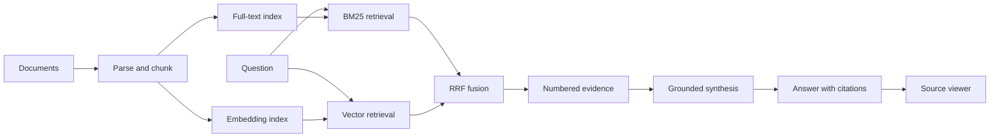

[简体中文](README.zh-CN.md) | English

# Citation-First RAG Blueprint

A method-first, vendor-neutral blueprint for building retrieval-augmented generation systems whose answers can be checked against source evidence.

This repository intentionally does **not** contain a production application, private corpus, crawler configuration, credentials, customer material, or deployment topology. It shares architecture decisions, safety boundaries, failure modes, and a tiny dependency-free RRF example using synthetic data.

## Why citation-first?

RAG is not trustworthy merely because it retrieved text. A useful knowledge assistant must preserve the chain:

```text
claim -> citation marker -> candidate chunk -> parent document -> original source
```

The blueprint therefore treats citation integrity as a system contract, not a prompt-writing preference.

## Reference architecture



Core design choices:

- hybrid retrieval instead of vector-only search;
- native database full-text search before adding a separate search service;
- brute-force cosine search for small corpora before adopting ANN infrastructure;
- document-aware and entity-aware retrieval when the user supplies scope;
- source metadata sent before streamed answer tokens;
- retrieved documents treated as untrusted data, not instructions;
- explicit evaluation of retrieval, citations, groundedness, latency, and cost.

## Repository contents

- [`SKILL.md`](SKILL.md): compact instructions for an AI coding agent.
- [`references/architecture.md`](references/architecture.md): boundaries and build order.
- [`references/retrieval.md`](references/retrieval.md): BM25, vectors, RRF, and scoped retrieval.
- [`references/citations-and-streaming.md`](references/citations-and-streaming.md): synthesis and SSE contracts.
- [`references/ingestion-and-uploads.md`](references/ingestion-and-uploads.md): parsing, two-track indexing, and recovery.
- [`references/knowledge-graph.md`](references/knowledge-graph.md): graph enrichment and entity-aware retrieval.
- [`references/security-and-evaluation.md`](references/security-and-evaluation.md): threat model and quality gates.
- [`references/production-gotchas.md`](references/production-gotchas.md): failures that are easy to miss in development.
- [`examples/minimal-rrf`](examples/minimal-rrf): dependency-free JavaScript example with synthetic rankings.

## Try the example

Requires Node.js 20 or newer.

```bash
cd examples/minimal-rrf
npm test
npm run demo
```

The example demonstrates only ranking fusion and citation mapping. It deliberately makes no network calls and contains no model integration.

## What this is not

- not a claim that citations make source material true;
- not a turnkey multi-tenant application;
- not a substitute for authentication, authorization, privacy review, or model evaluation;
- not a recommendation to add a vector database, graph database, or agent loop before evidence shows they are needed;
- not a benchmark claiming universal retrieval weights.

## Security posture

The public repository is built from an explicit allowlist. It contains synthetic examples only. See [SECURITY.md](SECURITY.md) and [SECURITY_REVIEW.md](SECURITY_REVIEW.md) for the disclosure policy and release review.

## License

MIT. See [LICENSE](LICENSE).
