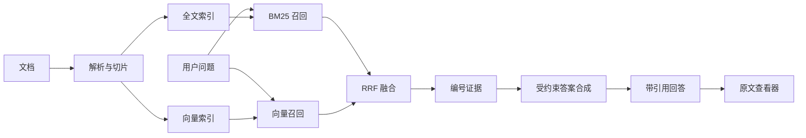

[English](README.md) | 简体中文

# Citation-First RAG Blueprint

一套以方法论为主、与模型厂商无关的 RAG 实现蓝图，目标是让回答能够沿引用回到证据，而不只是“看起来像查过资料”。

本仓库刻意不包含生产系统源码、真实语料、爬虫配置、密钥、客户材料或部署拓扑，只公开架构决策、安全边界、常见故障，以及一个使用合成数据的零依赖 RRF 示例。

## 为什么强调 Citation-first

“检索到了内容”不等于“回答可信”。一个可复核的知识助手必须保留完整链路：

```text
事实论点 -> 引用标记 -> 候选切片 -> 原始文档 -> 原始来源
```

因此，引用不是提示词里的软要求，而是后端、模型输出、前端渲染共同遵守的系统契约。

## 参考架构



关键决策：

- 使用混合检索，而不是只依赖向量召回；
- 优先使用数据库原生全文索引，避免过早增加独立搜索服务；
- 小语料先用内存暴力余弦检索，规模证明确有需要后再上 ANN；
- 用户绑定文件或实体时采用文档级、实体级检索；
- SSE 先发送来源，再发送回答 token；
- 把检索到的文档视为不可信数据，禁止其覆盖系统指令；
- 同时评估召回、引用正确性、答案 groundedness、延迟和成本。

## 仓库内容

- [`SKILL.md`](SKILL.md)：供 AI 编码智能体使用的精简指令。
- [`references/architecture.md`](references/architecture.md)：系统边界与构建顺序。
- [`references/retrieval.md`](references/retrieval.md)：BM25、向量、RRF 与范围检索。
- [`references/citations-and-streaming.md`](references/citations-and-streaming.md)：引用与 SSE 协议。
- [`references/ingestion-and-uploads.md`](references/ingestion-and-uploads.md)：解析、双轨索引与恢复。
- [`references/knowledge-graph.md`](references/knowledge-graph.md)：图谱增强与实体级检索。
- [`references/security-and-evaluation.md`](references/security-and-evaluation.md)：威胁模型与质量门槛。
- [`references/production-gotchas.md`](references/production-gotchas.md)：生产环境常见故障。
- [`examples/minimal-rrf`](examples/minimal-rrf)：合成数据驱动的零依赖 JavaScript 示例。

## 运行示例

需要 Node.js 20 或更高版本。

```bash
cd examples/minimal-rrf
npm test
npm run demo
```

示例仅演示排序融合和引用映射，不调用网络，也不包含任何模型接口。

## 本仓库不是什么

- 引用只能证明答案可追溯，不能证明来源本身正确；
- 不是可直接公网部署的多租户成品；
- 不能替代认证、授权、隐私审查和模型评测；
- 不鼓励在没有测量依据时直接引入向量数据库、图数据库或 Agent 循环；
- 文档中的权重只是起始值，不是普适最优参数。

## 安全说明

公开内容按白名单构建，仅包含合成示例。安全报告和漏洞披露方式见 [SECURITY_REVIEW.md](SECURITY_REVIEW.md) 与 [SECURITY.md](SECURITY.md)。

## 许可证

MIT，见 [LICENSE](LICENSE)。
